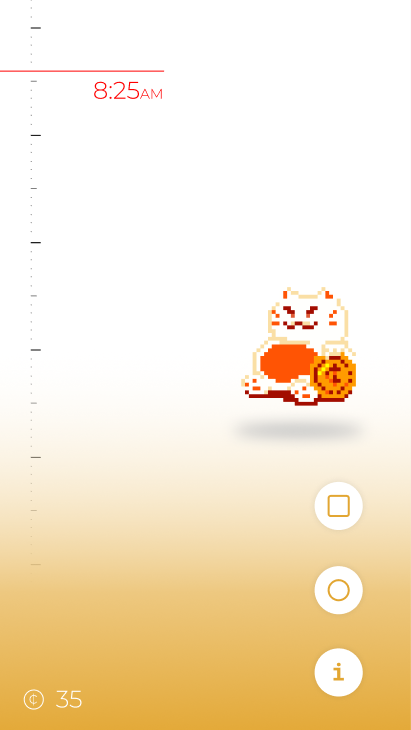
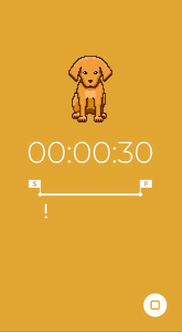

# USER MANUAL

Study Buddy is a productivity tool intended to assist you in remaining productive, via a virtual pet which grows as you commit to dedicated productivity sessions. The more you engage with the application, the more your pet will grow, trusting you more based on your success.

## Installing the Application

In order to install the application, you must have Android Studio installed, and an Android phone running at least Android 9.0. The steps to install the application are located in the repository's README file.

## Opening the Application

*Figure 1. The application home screen.*

Upon opening the application you will be greeted with the following screen.

- The top left region of the screen displays the current time. The bar along the left side represents the next several hours, with the red line representing the current time (unimplemented for now).

- The bottom left region of the screen displays the number of coins earned thus far. Coins can be used to buy various items for your pet (unimplemented for now).

- The right side of the screen displays your pet. To interact with the pet, tap on this region of the screen (unimplemented).

- The bottom right buttons allow for additional interaction (unimplemented).

## Starting a Session

Right after you open the app, you can start a session. To accomplish this, tap the time display in the top left of the screen. The red time marker will open up, revealing the "START SESSION" button.

*Figure 2. The "start session" button visible after tapping the current time.*

Tapping this button will begin an **impromptu session**. Impromptu sessions have no fixed length, and will go for as long as you need them.

*(Note: At this time, the session is always 8 minutes in length, rather than truly being impromptu)*

*Figure 3. The session view.*

Upon starting a session, the app will switch to the session view. The session view features the following:

- In the center of the screen, the current session duration will display.

- Below that, for sessions with a preset time duration, the app will display a timeline representing progression through the session. A time marker denotes how far into the session we are.

- In the bottom right we can stop the session. Tapping the button twice in succession ends the session.

- Above the session time, we can see the pet in an idle animation.

Once the session has begun, we can leave the application, and a notification will display indicating the current state of the session.

## Encountering Bugs

If you encounter any bugs while using the application, please post the bug as an issue on our [Github Repository](https://github.com/haciim/study_buddy_2020). Before posting, ensure that you are running the latest commit by pulling any changes from the repository (run "git pull" from your command line prompt of choice in the project root folder). Be sure to include the following:

- The device used to run the application (as well as specifying if the device is emulated), and the version of Android OS you are running.

- The steps required to reproduce the bug. These should be consistent, but if there are any edge cases be sure to note these as well.

- If possible, include a screenshot which shows the bug occurring.