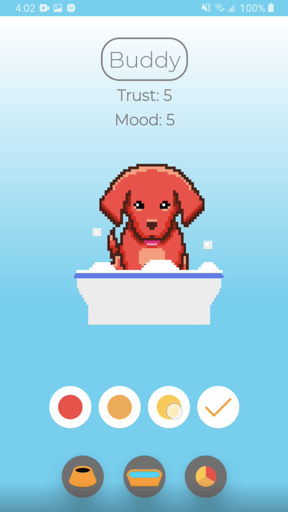

# USER MANUAL

Study Buddy is a productivity tool intended to assist you in remaining productive, via a virtual pet which grows as you commit to dedicated productivity sessions. The more you engage with the application, the more your pet will grow, trusting you more based on your success.

## Installing the Application

In order to install the application, you must have an Android phone running at least Android 9.0. The steps to install the application are located in [the repository's README file](https://github.com/haciim/study_buddy_2020/blob/master/README.md#running-the-system).

## Opening the Application

*Figure 1. The application home screen.*

Upon opening the application you will be greeted with the following screen.

- The top middle region of the screen displays the current time. The color gradient of the app is reflective of the time of day that the app has been opened during. 

- The middle region of the screen displays your pet and it's current action (see Pet Interaction section). The line surrounding the pet indicates you can click anywhere within those bounds to go to the pet's screen. 

- The list button on the bottom of the screen will take you to the session history view (see Session History section). 

## Starting a Session

Right after you open the app, you can start a session. To accomplish this, tap the "NEW SESSION" button in the top middle of the screen. You will then be prompted to provide more information about your impromptu session.  

*Figure 2. The session options slider visible after tapping the "NEW SESSION" button.*

You will have the ability to either pre-select the length of your session or set to infinite on the left side of the slider. You can select the type of session on the right side of the slider. A _Standard_ session is a regular session of your determined length. A _Pomadoro_ session is a session that follows the Pomadoro productivity idealogy. After selecting the "START SESSION" button on top of the slider, the app will switch to the session view and you will be prompted to provide a name for your session prior to beginning. 

*Figure 3. The session view with name prompting.*

Upon starting a session, the app will switch to the final session view. 

*Figure 4. The running session view.*

The session view features the following:

- In the center of the screen, the current session duration will display.

- Below that, for sessions with a preset time duration, the app will display a timeline representing progression through the session. A time marker denotes how far into the session we are.

- Above the session time, we can see the pet in a studying animation.

- Once the session has begun, we can leave the application, and a notification will display indicating the current state of the session. 

- In the bottom right we can stop the session by clicking on the home icon. Tapping the button twice in succession ends the session.

*Figure 5. The productivity rating screen.*

Once the session has been ended, you are able to rate the productivity of your session using a percentage scale. This will come into play with your pet's trust and mood levels which are described further in the Pet Interaction section. When you confirm and save your session, the title, time and productivity rating will be able to be viewed in the session history screen.

## Viewing the Session History 

You are able to access the session history by clicking the list button at the bottom of the home screen. 

*Figure 6. The session history screen.*

On the screen you are able to see a chronological list of all your past sessions, including the date, title, length and productivity rating. You can navigate back to the home screen by clicking the home icon in the bottom right corner of the screen. 

## Interacting with the Pet

You can view the below pet screen by clicking within the square around the pet on the home screen. 

*Figure 7. The main pet screen.*

On the screen you can view your pet's name, it's current mood and trust levels. Your pets mood level is based on the current days average productivity reports. The trust level is based off of the average productivity reports for that week. 

Additionally, you can see your pets current animation and some action buttons below it. You can feed and bathe the pet by clicking on the two buttons on the bottom of the screen that show a food bowl and bath tub. You can see your pet either in the eating or bathing animation. These actions are for cosmetic use only and either execute automatically if you have not done so and have no effect on the mood or trust levels of your pet. 

*Figure 8. The pet animations of eating and bathing.*

You are able to change your pets name by clicking on it's name at the top of screen once you have aquired a trust level of 6. 

*Figure 9. The renaming screen.*

You are able to change the color of your pet by clicking the bottom right icon that has a color wheel of our current color selections (gold, red, default). You must have a trust level of 7 or higher to change the color of your pet. This change will show up across the entire app and with all animations. 

*Figure 10. The color options for your pet.*

## Encountering Bugs

If you encounter any bugs while using the application, please post the bug as an issue on our [Github Repository](https://github.com/haciim/study_buddy_2020). Before posting, ensure that you are running the latest commit by pulling any changes from the repository (run "git pull" from your command line prompt of choice in the project root folder). Be sure to include the following:

- The device used to run the application (as well as specifying if the device is emulated), and the version of Android OS you are running.

- The steps required to reproduce the bug. These should be consistent, but if there are any edge cases be sure to note these as well.

- If possible, include a screenshot which shows the bug occurring.
